项目需求：实现多线程达到数据的亿级自增，并且尽可能让时间缩短 ,要求：  
(1)速度要快  
(2)安全性要高  
第1种方式
```java
package com.example.currency03;

import java.util.concurrent.atomic.AtomicLong;

/**
 * 1· 运用Thread、AtomicLong、线程join实现
 */
public class Counter1 {
    public static AtomicLong inc = new AtomicLong();
    public void increase() {
        // 数据加一
        inc.getAndIncrement();
    }

    public static void count() throws InterruptedException {
        final Counter1 c1 = new Counter1();
        Thread  th;
        long t1 = System.currentTimeMillis();

        for(int i = 0; i < 1000; i++) {
            th = new Thread(() -> {
                for(int j = 0; j < 100000; j++) {
                    c1.increase();
                }
            });
            th.start();
            th.join();
        }
        long t2 = System.currentTimeMillis();
        System.out.println("Counter1 , "+String.format("结果：%s,耗时(ms)：%s", inc, (t2 - t1)));
    }

    public static void main(String[] args) throws InterruptedException {
        for (int i = 0; i < 10; i++) {
            inc.set(0);
            count();
        }
    }
}

```
耗费时间如下：  
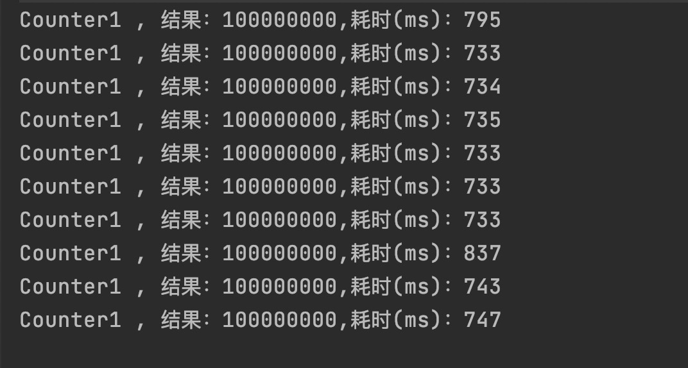  
第2种方式
```java
package com.example.currency03;

import java.util.concurrent.locks.Lock;
import java.util.concurrent.locks.ReentrantLock;

/**
 * 2、运用thread、reentrantlock、线程join
 */
public class Counter2 {
    public static Integer inc = 0;
    Lock lock = new ReentrantLock();
    public void increase() {
        lock.lock();
        try {
            inc++;
        } finally {
            lock.unlock();
        }
    }
    public static void count() throws InterruptedException {
        final Counter2 c2 = new Counter2();
        Thread th;
        Long t1 = System.currentTimeMillis();
        for(int i = 0; i < 1000; i++) {
            th = new Thread(() -> {
                for(int j = 0; j < 100000; j++) {
                    c2.increase();
                }
            });
            th.start();
            th.join();
        }
        long t2 = System.currentTimeMillis();
        System.out.println("Counter2 , "+String.format("结果：%s,耗时(ms)：%s", inc, (t2 - t1)));
    }

    public static void main(String[] args) throws InterruptedException {
        for (int i = 0; i < 10; i++) {
            inc = 0;
            count();
        }
    }
}

```
耗费时间如下：  
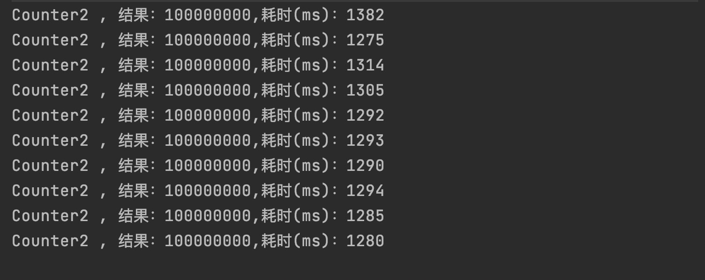  
第3种方式
```java
package com.example.currency03;
/**
 * 3、运用thread、synchronized、线程join
 */
public class Counter3 {
    public static Integer inc = 0;
    public synchronized void increase() {
        inc++;
    }
    public static void count() throws InterruptedException {
        final Counter3 c3 = new Counter3();
        Thread th;
        long t1 = System.currentTimeMillis();
        for (int i = 0; i < 1000; i++) {
            th = new Thread(() -> {
                for(int j = 0; j < 100000; j++) {
                    c3.increase();
                }
            });
            th.start();
            th.join();
        }
        long t2 = System.currentTimeMillis();
        System.out.println("Counter3, "+String.format("结果：%s,耗时(ms)：%s", inc, (t2 - t1)));
    }

    public static void main(String[] args) throws InterruptedException {
        for (int i = 0; i < 10; i++) {
            inc = 0;
            count();
        }

    }
}

```
耗费时间如下：  
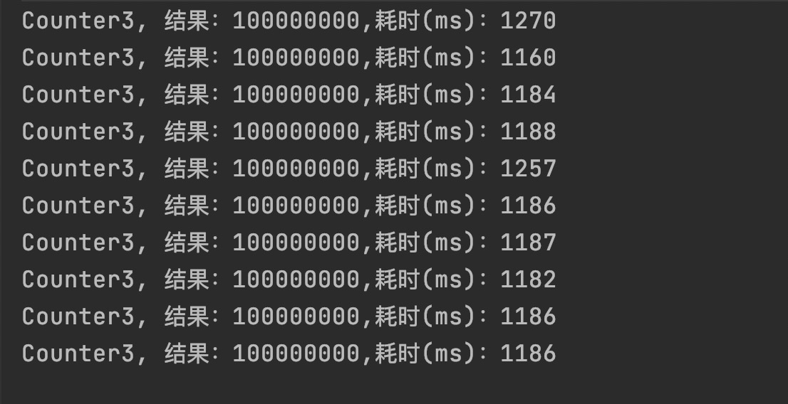  
第4种方式  
```java
package com.example.currency03;

import java.util.concurrent.atomic.AtomicLong;

/**
 * 4、运用thread、AtomicLong、线程状态TERMINATED
 */
public class Counter4 {
    public static AtomicLong inc = new AtomicLong();
    public void crease() {
        inc.getAndIncrement();
    }
    public static void count() throws InterruptedException {
        final Counter4 c4 = new Counter4();
        long t1 = System.currentTimeMillis();
        Thread  th = null;
        for(int i = 0; i < 1000; i++) {
            th = new Thread(() -> {
                for(int j = 0; j < 100000; j++) {
                    c4.crease();
                }
            });
            th.start();
            while(th.getState()!=Thread.State.TERMINATED){
                Thread.sleep(1);
            }
        }
        long t2 = System.currentTimeMillis();
        System.out.println("Counter4, "+String.format("结果：%s,耗时(ms)：%s", inc, (t2 - t1)));
    }

    public static void main(String[] args) throws InterruptedException {
        for (int i = 0; i < 10; i++) {
            inc.set(0);
            count();
        }
    }

}

```
耗费时间如下：  
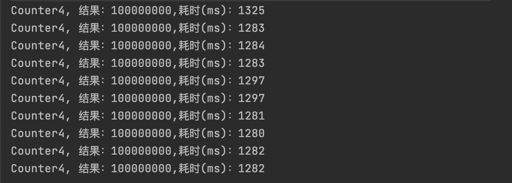  
第5种方式
```java
package com.example.currency03;

import java.util.concurrent.atomic.AtomicLong;

/**
 * 5、运用Thread、AtomicLong、线程isAlive等实现
 */
public class Counter5 {
    public static AtomicLong inc = new AtomicLong();
    public void increase() {
        inc.getAndIncrement();
    }
    public static void count() throws InterruptedException {
        final Counter5 c5 = new Counter5();
        Thread  th = null;
        long t1 = System.currentTimeMillis();
        for(int i = 0; i < 1000; i++) {
            th = new Thread(() -> {
                for(int j = 0; j < 100000; j++) {
                    c5.increase();
                }
            });
            th.start();
            while(th.isAlive()){
                Thread.sleep(1);
            }

        }
        long t2 = System.currentTimeMillis();
        System.out.println("Counter5, "+String.format("结果：%s,耗时(ms)：%s", inc, (t2 - t1)));
    }

    public static void main(String[] args) throws InterruptedException {
        for (int i = 0; i < 10; i++) {
            inc.set(0);
            count();
        }

    }
}

```
耗费时间如下：  
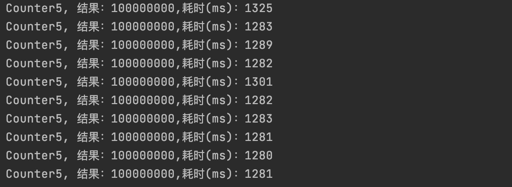  
第6种方式  
```java
package com.example.currency03;

import java.util.concurrent.CountDownLatch;
import java.util.concurrent.ExecutionException;

/**
 * 6、运用Thread、synchronized、线程CountDownLatch等实现
 */
public class Counter6 {
    public static int inc = 0;
    public synchronized static void increase() {
        inc++;
    }
    public static void count() throws InterruptedException {
        int threadCount = 1000;
        long t1 = System.currentTimeMillis();

        CountDownLatch countDownLatch = new CountDownLatch(threadCount);
        for(int i = 0; i < threadCount; i++) {
            new Thread(() -> {
                try {
                    for (int j = 0; j < 100000; j++) {
                        increase();
                    }
                } finally {
                    countDownLatch.countDown();
                }

            }).start();


        }
        countDownLatch.await();
        long t2 = System.currentTimeMillis();
        System.out.println("Counter6, "+String.format("结果：%s,耗时(ms)：%s", inc, (t2 - t1)));

    }
    public static void main(String[] args) throws ExecutionException, InterruptedException {
        for (int i = 0; i < 10; i++) {
            inc = 0;
            count();
        }
    }

}

```
耗费时间如下：  
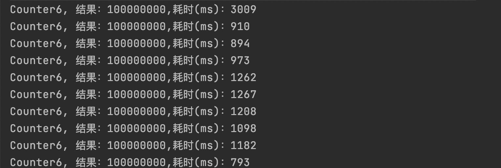  
第7种方式  
```java
package com.example.currency03;

import java.util.concurrent.CountDownLatch;
import java.util.concurrent.ExecutionException;
import java.util.concurrent.atomic.AtomicLong;

/**
 * 7、运用Thread、AtomicLong、线程CountDownLatch等实现
 */
public class Counter7 {
    public static AtomicLong inc = new AtomicLong(0);
    public static void increase() {
        inc.getAndIncrement();
    }
    public static void count() throws InterruptedException {
        int threadCount = 1000;
        long t1 = System.currentTimeMillis();
        CountDownLatch countDownLatch = new CountDownLatch(threadCount);
        for(int i = 0; i < threadCount; i++) {
            new Thread(() -> {
            try {

                    for(int j = 0; j < 100000; j++) {
                        increase();
                    }

            } finally {
                countDownLatch.countDown();
            }
        }).start();
        }
        countDownLatch.await();
        long t2 = System.currentTimeMillis();
        System.out.println("Counter7, "+String.format("结果：%s,耗时(ms)：%s", inc, (t2 - t1)));
    }

    public static void main(String[] args) throws ExecutionException, InterruptedException {
        for (int i = 0; i < 10; i++) {
            inc.set(0);
            count();
        }
    }
}

```
耗费时间如下：  
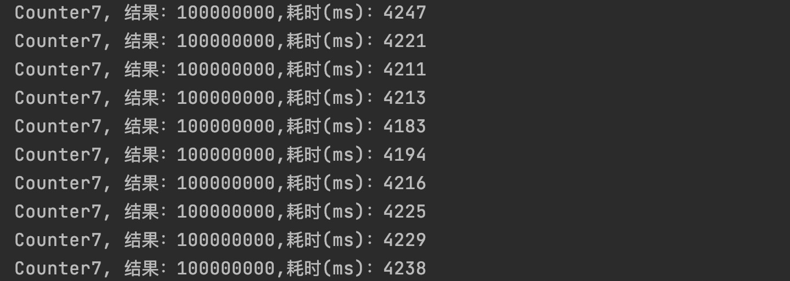  
第8种方式  
```java
package com.example.currency03;

import java.util.concurrent.CountDownLatch;
import java.util.concurrent.ExecutionException;
import java.util.concurrent.atomic.LongAdder;

/**
 * 8、运用Thread、LongAddr、线程CountDownLatch等实现
 */
public class Counter8 {
    public static LongAdder longAdder = new LongAdder();

    public static void increase() {
        longAdder.increment();
    }

    public static void count() throws InterruptedException {
        int threadCount = 1000;
        long t1 = System.currentTimeMillis();

        CountDownLatch countDownLatch = new CountDownLatch(threadCount);
        for (int i = 0; i < threadCount; i++) {
            new Thread(() -> {
                try {
                    for (int j = 0; j < 100000; j++) {
                        increase();
                    }

                } finally {
                    countDownLatch.countDown();
                }
            }).start();
        }
        countDownLatch.await();
        long t2 = System.currentTimeMillis();
        System.out.println("Counter8, " + String.format("结果：%s,耗时(ms)：%s", longAdder.sum(), (t2 - t1)));

    }

    public static void main(String[] args) throws ExecutionException, InterruptedException {
        for (int i = 0; i < 10; i++) {
            longAdder.reset();
            count();
        }
    }
}
```
耗费时间如下：  
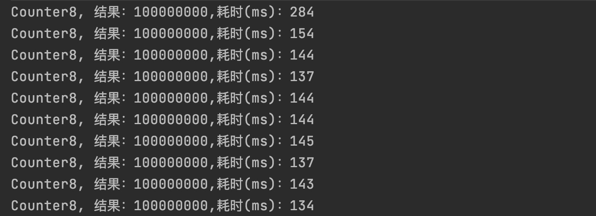  
第9种方式  
```java
package com.example.currency03;

import java.util.concurrent.CountDownLatch;
import java.util.concurrent.ExecutionException;
import java.util.concurrent.atomic.LongAccumulator;

/**
 * 9、运用Thread、LongAccumulator、线程CountDownLatch等实现
 */
public class Counter9 {
    private static LongAccumulator inc = new LongAccumulator((x, y) -> x + y, 0L);

    public static void incr() {
        inc.accumulate(1);
    }

    public static void count() throws InterruptedException {
        int threadCount = 1000;
        long t1 = System.currentTimeMillis();
        CountDownLatch countDownLatch = new CountDownLatch(threadCount);
        for(int i = 0; i < threadCount; i++) {
            new Thread(() -> {
                try {
                    for(int j = 0; j < 100000; j++) {
                        incr();
                    }
                } finally {
                    countDownLatch.countDown();
                }

            }).start();
        }
        countDownLatch.await();
        long t2 = System.currentTimeMillis();
        System.out.println("Counter9, "+String.format("结果：%s,耗时(ms)：%s", inc.longValue(), (t2 - t1)));

    }

    public static void main(String[] args) throws ExecutionException, InterruptedException {
        for (int i = 0; i < 10; i++) {
            inc.reset();
            count();
        }
    }

}

```
耗费时间如下：  
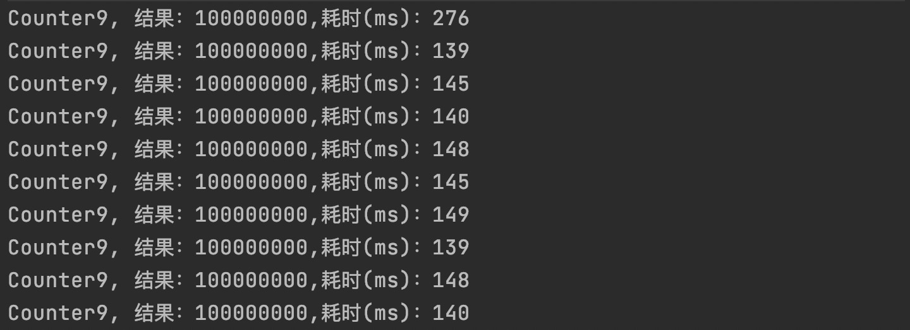  
第10种方式  
```java
package com.example.currency03;

import java.util.concurrent.atomic.LongAdder;

/**
 * 10、运用Thread、LongAdder、线程join的实现
 */
public class Counter10 {
    public static LongAdder inc = new LongAdder();

    public  void increase() {
        inc.increment();
    }

    public static void main(String[] args) throws InterruptedException {
        for (int i = 0; i < 10; i++) {
            inc.reset();
            count();
        }

    }

    private static void count() throws InterruptedException {
        final Counter10 test = new Counter10();
        Thread  th;
        long t1 = System.currentTimeMillis();
        for(int i=0;i<1000;i++){
            th= new Thread(() -> {
                for(int j = 0;j < 100000;j++) {
                    test.increase();
                }
            });
            th.start();
            th.join();
        }

        long t2 = System.currentTimeMillis();
        System.out.println("Counter10 , "+String.format("结果：%s,耗时(ms)：%s", inc, (t2 - t1)));
    }

}

```
耗费时间如下：  
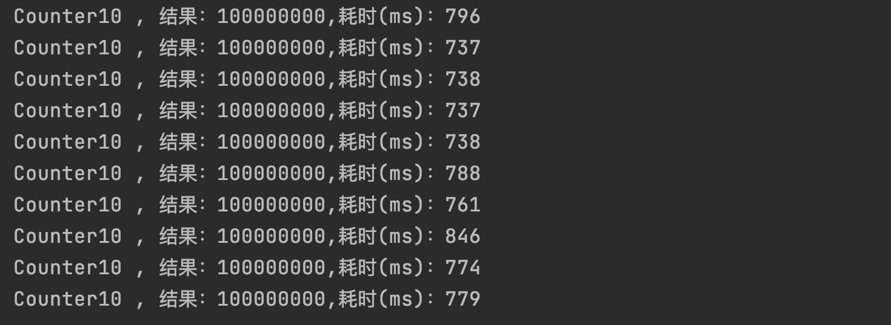  
第11种方式  
```java
package com.example.currency03;

import java.util.concurrent.atomic.LongAccumulator;

/**
 * 运用Thread、LongAccumulator、线程join的实现
 */
public class Counter11 {
    static LongAccumulator inc = new LongAccumulator((x, y) -> x + y, 0L);

    public  void increase() {
        inc.accumulate(1);
    }

    public static void main(String[] args) throws InterruptedException {
        for (int i = 0; i < 10; i++) {
            inc.reset();
            count();
        }

    }

    private static void count() throws InterruptedException {
        final Counter11 test = new Counter11();
        Thread  th;
        long t1 = System.currentTimeMillis();
        for(int i=0;i<1000;i++){
            th= new Thread(() -> {
                for(int j = 0; j < 100000; j++) {
                    test.increase();
                }
            });
            th.start();
            th.join();
        }

        long t2 = System.currentTimeMillis();
        System.out.println("Counter11 , "+String.format("结果：%s,耗时(ms)：%s", inc, (t2 - t1)));
    }

}

```
耗费时间如下：  
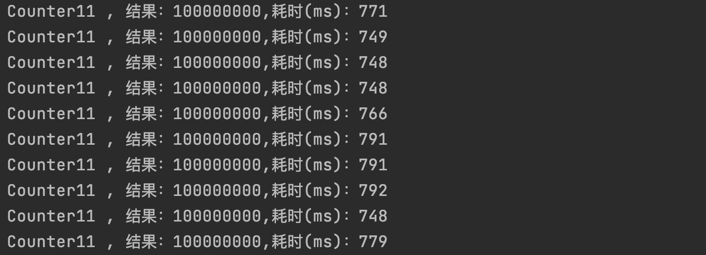  